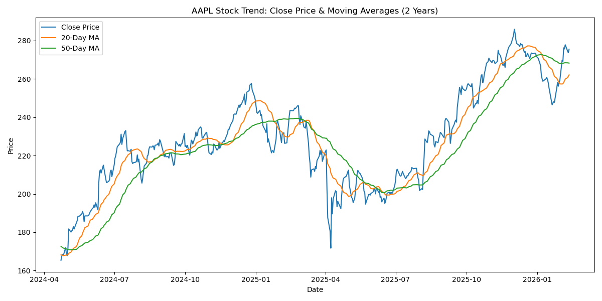
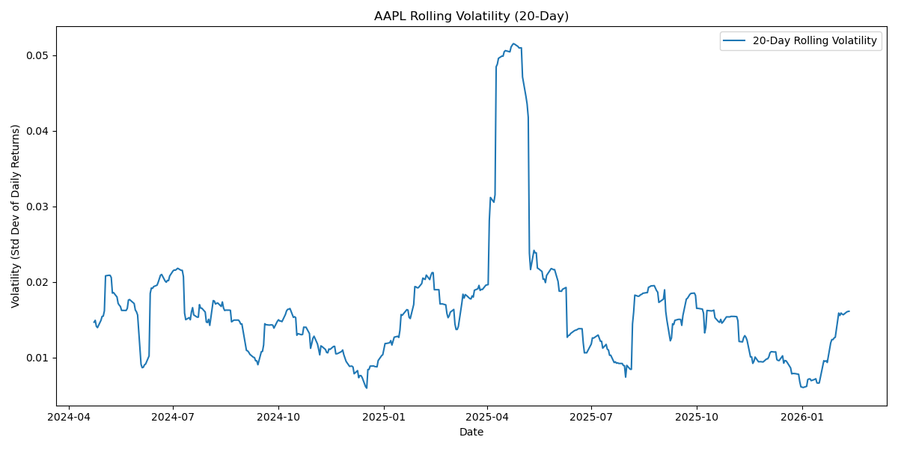

# Stock Market Trend Analysis (AAPL) - Python

## Overview
This project analyzes two years of historical Apple (AAPL) stock data to identify trends and measure market risk using technical indicators.

The analysis applies financial time-series techniques to generate data-driven insights for investment evaluation.

---

## Features

- Downloads historical stock data using `yfinance`
- Computes 20-day and 50-day moving averages
- Calculates daily returns
- Measures 20-day rolling volatility (risk indicator)
- Generates and saves professional financial visualizations

---

## Technical Indicators Implemented

### 1️ Moving Averages
Used 20-day and 50-day moving averages to evaluate short-term and medium-term trend momentum.

### 2️ Rolling Volatility
Calculated rolling standard deviation of daily returns to assess price fluctuation intensity and market risk.

---

## Tech Stack
- Python  
- Pandas  
- Matplotlib  
- yfinance  
- NumPy  

---

## How to Run

```bash
pip install yfinance pandas matplotlib
python stock_trend_analysis.py

Output

Sample Visualizations





Skills Demonstrated

Financial Data Analysis

Time Series Modeling

Risk Measurement

Data Visualization

Technical Indicator Implementation

Project Purpose

This project demonstrates the practical application of Python in financial analytics and highlights the ability to transform raw financial data into meaningful investment insights.
